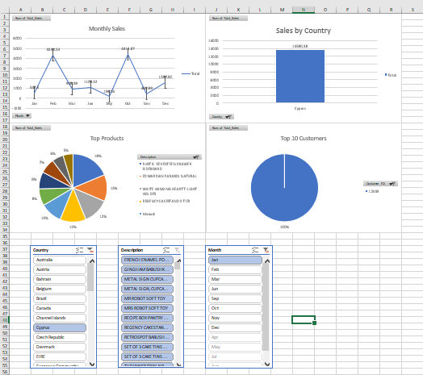

# excel-sales-dashboard
Sales Data Analysis using Excel (Pivot Tables &amp; Dashboard)

# 📊 Excel Sales Dashboard Project

## 📌 Overview

This project presents a complete data analysis workflow using Microsoft Excel on a large retail dataset (500,000+ rows).
The goal was to clean raw data, perform analysis, and build an interactive dashboard for business insights.

---

## 📂 Dataset

* Source: UCI Machine Learning Repository (Online Retail Dataset)
* Data includes:

  * Transactions
  * Products
  * Customers
  * Countries
  * Sales values

⚠️ Note: The dataset is large (>25MB) and is not uploaded here.
You can download it from the official source.

---

## 🔧 Tools & Techniques Used

* Microsoft Excel
* Data Cleaning
* Pivot Tables
* Pivot Charts
* Slicers (interactive filters)
* Basic KPI metrics

---

## 🧹 Data Cleaning Steps

* Removed cancelled transactions (Invoice starting with “C”)
* Removed rows with missing Customer IDs
* Removed negative/zero Quantity and UnitPrice values
* Standardized date formats
* Removed empty rows

---

## 📈 Analysis Performed

### 1. Sales by Country

* Identified countries contributing the highest revenue

### 2. Monthly Sales Trend

* Analyzed how sales change over time

### 3. Top Products

* Ranked products based on total sales

### 4. Customer Segmentation

* Identified high-value customers

---

## 📊 Dashboard Features

* Interactive charts:

  * Sales by Country
  * Monthly Sales Trend
  * Top Products
  * Top Customers
* Slicers for filtering:

  * Country
  * Month
  * Product
* KPI Metrics:

  * Total Revenue
  * Total Orders
  * Total Customers

---

## 🖼️ Dashboard Preview

(Add your screenshot here)

```

```

---

## 📁 Files Included

* Excel Dashboard File
* Dashboard Screenshot

---

## 🎯 Key Skills Demonstrated

* Data Cleaning and Preparation
* Data Analysis using Pivot Tables
* Data Visualization
* Dashboard Design in Excel
* Handling Large Datasets

---

## 🚀 How to Use

1. Open the Excel file
2. Go to the Dashboard sheet
3. Use slicers to filter data dynamically

---

## 💡 Future Improvements

* Add advanced analysis (RFM segmentation)
* Automate data cleaning using Power Query
* Enhance dashboard design

---

## ⭐ If you like this project

Feel free to star ⭐ the repository!
